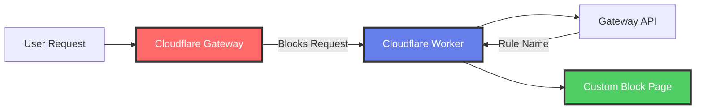

# Cloudflare Gateway Rule Blocking Page

[](https://deploy.workers.cloudflare.com/?url=https://github.com/macharpe/cloudflare-gateway-rule-blocking-page)

A Cloudflare Worker that serves custom blocking pages for Cloudflare Gateway rules with dynamic rule name retrieval. When users hit blocked content, they see a user-friendly page showing exactly which security rule blocked their request.

## Features

- 🛡️ **Dynamic Rule Names**: Automatically retrieves and displays the actual Gateway rule name that blocked the request
- 🎨 **Professional UI**: Clean, responsive blocking page with modern design
- 📱 **Mobile Friendly**: Responsive design that works on all devices
- 🚀 **High Performance**: Uses KV storage for caching to minimize API calls
- 🔄 **API Support**: JSON API endpoints for programmatic access
- 🔒 **Security Headers**: Includes proper security headers for safe operation

## Architecture



## How It Works

1. **Gateway Rule Configuration**: Configure your Cloudflare Gateway DNS and HTTP rules to redirect to this worker with "Send policy context" enabled
2. **Request Processing**: When a request is blocked, Gateway redirects to the worker with rule parameters
3. **Rule Name Lookup**: Worker queries the Cloudflare Zero Trust API to get the human-readable rule name
4. **Custom Page**: Displays a professional blocking page with the specific rule information
5. **Caching**: Rule names are cached for better performance and reduced API usage

## Supported Gateway Rule Types

- ✅ **DNS Policies**: Full support with URL redirection and policy context
- ✅ **HTTP Policies**: Full support with URL redirection and policy context  
- ❌ **Network Policies**: Not supported (L3/L4 level doesn't support URL redirection)

## Prerequisites

- Cloudflare account with Zero Trust/Gateway enabled
- Node.js and npm installed
- Wrangler CLI installed (`npm install -g wrangler`)

## Setup and Configuration

### 1. Clone and Install

```bash
git clone <repository-url>
cd cloudflare-gateway-rule-blocking-page
npm install
```

### 2. Configure Wrangler

Edit `wrangler.jsonc` to match your setup:

```json
{
  "name": "gateway-blocking-page",
  "main": "src/index.js",
  "compatibility_date": "2024-08-01",
  
  "routes": [
    { "pattern": "block.yourdomain.com/*", "zone_name": "yourdomain.com" }
  ],

  "kv_namespaces": [
    {
      "binding": "RULE_CACHE",
      "id": "your-kv-namespace-id",
      "preview_id": "your-preview-kv-namespace-id"
    }
  ]
}
```

### 3. Create KV Namespace (Optional but Recommended)

```bash
wrangler kv:namespace create "RULE_CACHE"
wrangler kv:namespace create "RULE_CACHE" --preview
```

Update the namespace IDs in `wrangler.jsonc`.

### 4. Set Environment Variables

Create a Cloudflare API token with Zero Trust Gateway permissions:

```bash
wrangler secret put CLOUDFLARE_API_TOKEN
wrangler secret put CLOUDFLARE_ACCOUNT_ID
```

### 5. Deploy

```bash
npm run deploy
```

### 6. Configure Gateway Rules

In your Cloudflare Zero Trust dashboard:

1. Go to Gateway → Policies
2. Edit your DNS/HTTP rules
3. Set Action to "Block" 
4. Enable "Send policy context"
5. Set redirect URL to: `https://block.yourdomain.com/?rule_id={{.RuleID}}&blocked_url={{.BlockedURL}}&category={{.Category}}&timestamp={{.Timestamp}}`

## Usage

### HTML Blocking Page

When users access blocked content, they'll see a professional blocking page with:

- Clear "Access Blocked" message
- Specific rule name that blocked the request
- Blocked URL (if available)
- Category and timestamp information
- Navigation options (Go Back, Go to Homepage)

### JSON API

The worker also provides JSON responses for programmatic access:

```bash
curl -H "Accept: application/json" "https://block.yourdomain.com/?rule_id=abc123"
```

Response:
```json
{
  "blocked": true,
  "rule_id": "abc123",
  "rule_name": "Block Social Media",
  "blocked_url": "https://facebook.com",
  "category": "Social Networking",
  "timestamp": "2024-08-10T15:30:00.000Z"
}
```

## URL Parameters

The worker accepts these query parameters from Gateway:

- `rule_id` or `ruleid`: Gateway rule ID (required for rule name lookup)
- `blocked_url` or `url`: The URL that was blocked
- `category`: Policy category
- `timestamp`: When the block occurred

## Development

### Local Development

```bash
npm run dev
```

### View Logs

```bash
npm run tail
```

### Code Formatting

```bash
npm run format
npm run lint
```

## File Structure

```
├── src/
│   └── index.js           # Main worker code
├── wrangler.jsonc         # Wrangler configuration
├── package.json           # Dependencies and scripts
├── .gitignore            # Git ignore rules
├── README.md             # This file
└── CLAUDE.md             # Development guidance
```

## Environment Variables

| Variable | Required | Description |
|----------|----------|-------------|
| `CLOUDFLARE_API_TOKEN` | Yes | API token with Zero Trust Gateway permissions |
| `CLOUDFLARE_ACCOUNT_ID` | Yes | Your Cloudflare account ID |
| `RULE_CACHE` | No | KV namespace binding for caching rule names |

## API Rate Limits

The worker implements caching to minimize API calls to Cloudflare's Gateway API:

- Rule names are cached for 1 hour
- Failed lookups fall back to showing rule ID
- Graceful degradation if API is unavailable

## Security Considerations

- API tokens are stored as Wrangler secrets (not in code)
- Security headers prevent clickjacking and content sniffing
- No sensitive information is logged or displayed
- CORS headers allow safe cross-origin API access

## Troubleshooting

### Rule Names Not Displaying

1. Verify `CLOUDFLARE_API_TOKEN` has correct permissions
2. Check `CLOUDFLARE_ACCOUNT_ID` is correct
3. Ensure Gateway rules have "Send policy context" enabled
4. Check worker logs: `wrangler tail`

### Gateway Not Redirecting

1. Verify Gateway rule action is set to "Block"
2. Ensure "Send policy context" is enabled in rule settings
3. Check redirect URL format includes required parameters
4. Test rule matches the intended traffic

### Performance Issues

1. Ensure KV namespace is configured for caching
2. Monitor API call frequency in logs
3. Consider increasing cache TTL if needed

## Contributing

1. Fork the repository
2. Create a feature branch
3. Make your changes
4. Test locally with `wrangler dev`
5. Submit a pull request

## License

This project is licensed under the GNU General Public License v3.0 or later - see the [LICENSE](LICENSE) file for details.

## Support

For issues and questions:

1. Check the troubleshooting section above
2. Review Cloudflare Gateway documentation
3. Open an issue in this repository