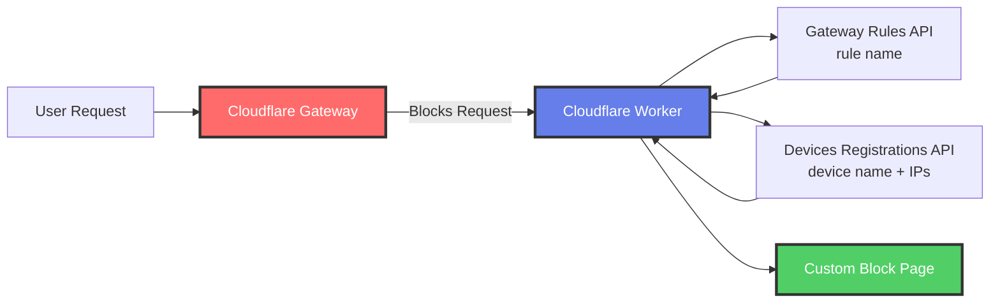

# Cloudflare Gateway Rule Blocking Page


[](https://deploy.workers.cloudflare.com/?url=https://github.com/macharpe/cloudflare-gateway-rule-blocking-page)

A Cloudflare Worker that replaces the default Cloudflare Gateway block page with a branded, context-aware alternative. When a DNS or HTTP policy blocks a request, the Worker surfaces all available Gateway policy context — rule name, policy type, blocked URL, content categories, user identity, device name, Cloudflare One Client IP addresses, and Ray ID — giving both the end user and support teams a comprehensive reference for diagnosing and resolving block events.

## Features

- **Dynamic Rule Names**: Resolves the Gateway rule UUID to a human-readable name via the Zero Trust API
- **Policy Type**: Displays whether the block originated from an HTTP or DNS policy
- **Device Name**: Resolves the device UUID to a human-readable device name
- **Cloudflare One Client IPs**: Displays the virtual IPv4 and IPv6 addresses assigned to the blocked device
- **Ray ID**: Surfaces the Cloudflare Ray ID for support reference
- **User Email**: Displays the user identity from Gateway context
- **Contact Administrator**: Modal with pre-filled email body containing all incident details, with clipboard copy support
- **Professional UI**: Responsive Cloudflare-branded dark/light mode blocking page
- **JSON API**: Programmatic access endpoint (`Accept: application/json`)
- **KV Caching**: Rule and device names cached with configurable TTL (default: 1 hour)
- **Cache API**: Cloudflare One Client IPs cached at the edge for 2 minutes
- **Retry Logic**: Exponential backoff on API rate limits (429) and server errors (5xx)
- **Security Hardened**: CSP with per-request nonce, XSS escaping, strict CORS, `no-store` cache, Gateway context validation

## Demo


## Architecture


```mermaid
graph LR
    A[User Request] --> B[Cloudflare Gateway]
    B -->|Blocks Request| C[Cloudflare Worker]
    C --> D1[Gateway Rules API\nrule name]
    C --> D2[Devices Registrations API\ndevice name + IPs]
    D1 --> C
    D2 --> C
    C --> E[Custom Block Page]

    style B fill:#ff6b6b,stroke:#333,stroke-width:3px,color:#fff
    style C fill:#667eea,stroke:#333,stroke-width:3px,color:#fff
    style E fill:#51cf66,stroke:#333,stroke-width:3px,color:#fff
```

## Gateway Context Fields

All fields are supplied by Gateway via query parameters when "Send policy context" is enabled:

| Field displayed | Gateway param | API enrichment |
|---|---|---|
| Rule name | `cf_rule_id` | `GET /gateway/rules/{id}` → human-readable name |
| Policy type | `cf_filter` | Mapped: `http` → HTTP Policy, `dns` → DNS Policy |
| Blocked URL | `cf_site_uri` | — |
| Category | `cf_request_category_names` | — |
| User email | `cf_user_email` | — |
| Device name | `cf_device_id` | `GET /devices/registrations?device.id=` → device name |
| CF One Client IPv4/IPv6 | `cf_device_id` | `GET /devices/registrations?device.id=` → virtual IPs |
| Ray ID | `cf_ray_id` / `CF-Ray` header | — |
| Time | `timestamp` | — |

## Supported Gateway Policy Types

- **HTTP Policies**: Full support — all context fields available
- **DNS Policies**: Full support — URL and device context available
- **Network Policies (L4)**: Not supported — L4 does not support URL redirection

## Prerequisites

- Cloudflare account with Zero Trust / Gateway enabled
- Node.js v18 or later
- Wrangler CLI (`npm install`)
- A Cloudflare API token with **Zero Trust Read** permission

## Setup

### 1. Clone and install

```bash
git clone https://github.com/macharpe/cloudflare-gateway-rule-blocking-page
cd cloudflare-gateway-rule-blocking-page
npm install
```

### 2. Create a KV namespace

```bash
npx wrangler kv namespace create "RULE_CACHE"
npx wrangler kv namespace create "RULE_CACHE" --preview
```

Update the namespace IDs in `wrangler.jsonc`.

### 3. Configure `wrangler.jsonc`

```json
{
  "name": "gateway-blocking-page",
  "main": "src/index.js",
  "compatibility_date": "2024-08-01",
  "routes": [
    { "pattern": "block.yourdomain.com/*", "zone_name": "yourdomain.com" }
  ],
  "kv_namespaces": [
    {
      "binding": "RULE_CACHE",
      "id": "your-kv-namespace-id",
      "preview_id": "your-preview-kv-namespace-id"
    }
  ],
  "vars": {
    "ADMIN_EMAIL": "helpdesk@yourdomain.com",
    "CACHE_TTL": "3600",
    "ALLOWED_ORIGINS": "https://admin.yourdomain.com"
  }
}
```

### 4. Set secrets

```bash
npx wrangler secret put CLOUDFLARE_API_TOKEN   # Zero Trust Read scoped token
npx wrangler secret put CLOUDFLARE_ACCOUNT_ID  # Your account ID
```

### 5. Deploy

```bash
npm run deploy
```

### 6. Configure Gateway

In the Cloudflare Zero Trust dashboard:

1. **Settings → Custom Pages → Account Gateway Block Page → Manage**
2. Select **URL Redirect**
3. Enter your Worker URL (e.g. `https://block.yourdomain.com/`)
4. Enable **Send policy context**
5. Save

To override on a per-policy basis, edit any DNS or HTTP policy → Block action → Custom block page.

## Testing the page

### Option 1 — Direct URL with fake params

```
https://block.yourdomain.com/?cf_user_email=you@example.com&cf_site_uri=https%3A%2F%2Fexample.com&cf_filter=http&cf_request_category_names=Gambling&cf_ray_id=abc123
```

### Option 2 — Real rule ID

Grab a Gateway rule UUID from your Zero Trust dashboard and substitute it:

```
https://block.yourdomain.com/?cf_rule_id=<uuid>&cf_user_email=you@example.com&cf_site_uri=https%3A%2F%2Fexample.com&cf_filter=http
```

### Option 3 — End-to-end via Gateway

On a Cloudflare One Client-enrolled device, visit a domain matched by a Block policy. Gateway redirects the browser to the Worker with all real context including `cf_device_id`, triggering device name and IP lookups.

### Option 4 — Local dev

```bash
npx wrangler dev --remote   # uses live secrets
```

## JSON API

Send `Accept: application/json` to get structured data:

```bash
curl -H "Accept: application/json" \
  "https://block.yourdomain.com/?cf_rule_id=abc123&cf_device_id=def456&cf_filter=http"
```

Response:

```json
{
  "blocked": true,
  "rule_id": "abc123",
  "rule_name": "Block Gambling",
  "blocked_url": "https://gambling.com",
  "category": "Gambling",
  "filter_type": "http",
  "device_id": "def456",
  "device_name": "My Laptop",
  "cf1client_ipv4": "100.96.0.1",
  "cf1client_ipv6": "2606:4700:0cf1:1000::1",
  "ray_id": "abc123def456",
  "timestamp": "2026-07-05T10:00:00.000Z"
}
```

## Environment Variables

| Variable | Type | Required | Description |
|---|---|---|---|
| `CLOUDFLARE_API_TOKEN` | Secret | Yes | Zero Trust Read scoped API token |
| `CLOUDFLARE_ACCOUNT_ID` | Secret | Yes | Cloudflare account ID |
| `ADMIN_EMAIL` | Var | No | Helpdesk email shown in Contact modal (default: `admin@example.com`) |
| `CACHE_TTL` | Var | No | KV cache TTL in seconds for rule/device names (default: `3600`) |
| `ALLOWED_ORIGINS` | Var | No | Comma-separated allowed CORS origins for JSON API |
| `RULE_CACHE` | KV binding | No | KV namespace for caching rule and device names |

## Caching Strategy

| Data | Store | TTL | Notes |
|---|---|---|---|
| Rule names | KV (`RULE_CACHE`) | `CACHE_TTL` (default 1h) | Keyed `rule:{id}` |
| Device names | KV (`RULE_CACHE`) | `CACHE_TTL` (default 1h) | Keyed `device:{id}` |
| CF One Client IPs | Cache API (`caches.default`) | 2 minutes | Keyed by account + device ID |
| HTML page | `Cache-Control: no-store` | — | Must not be cached — contains per-request CSP nonce |

## Security

- **Gateway context validation**: Returns `403` if no Gateway query parameters are present — prevents direct Worker URL access
- **CSP with per-request nonce**: `script-src 'nonce-{n}'` — nonce regenerated on every request; HTML is `no-store` to prevent nonce reuse from cache
- **XSS escaping**: All user-supplied values pass through `escapeHtml()` before rendering
- **No inline event handlers**: All JS wired via `addEventListener` inside the nonce-guarded `<script>` block
- **CORS allowlist**: `ALLOWED_ORIGINS` env var; unauthorized origins receive `Access-Control-Allow-Origin: null`
- **Security headers**: `X-Frame-Options: DENY`, `X-Content-Type-Options: nosniff`, `Referrer-Policy: no-referrer`
- **Secrets**: API token and account ID stored as Wrangler secrets — never in vars or HTML

## API Resilience

- **KV cache**: Prevents repeated API calls for the same rule/device
- **Retry with exponential backoff**: 1s → 2s → 4s on 429 and 5xx responses (up to 3 retries)
- **Graceful degradation**: Falls back to `Rule {id}` / `Device {id}` if API is unavailable; CF One Client IPs simply omitted if lookup fails

## Development

```bash
npm run dev      # local dev server
npm test         # jest test suite (34 tests, ≥80% coverage threshold)
npm run lint     # eslint
npm run format   # prettier
npm run tail     # live Worker logs
npm run deploy   # deploy to Cloudflare
```

## File Structure

```
├── src/
│   ├── index.js              # Main Worker — all logic
│   └── __tests__/
│       ├── index.test.js     # 34 tests across all features
│       └── setup.js          # Node.js polyfills + Cache API mock
├── wrangler.jsonc            # Wrangler configuration
├── package.json
├── eslint.config.js
├── jest.config.js
├── babel.config.js
└── README.md
```

## Troubleshooting

### Rule name shows as `Rule {id}`
- Verify `CLOUDFLARE_API_TOKEN` has Zero Trust Read permission
- Verify `CLOUDFLARE_ACCOUNT_ID` is correct
- Check Worker logs: `npm run tail`

### Device name or CF One Client IPs not showing
- Requires `cf_device_id` in the Gateway redirect URL — only present for Cloudflare One Client-enrolled devices
- Verify the API token has Device Read permission under Zero Trust
- CF One Client IPs only appear for active registrations with assigned virtual IPs

### Gateway not redirecting to the Worker
- Verify the block policy action is **Block** (not Allow/Bypass)
- Confirm **Send policy context** is enabled
- Confirm the Worker URL is correctly set under Custom Pages

### Contact Administrator button not working
- Ensure the Worker is deployed (not served from an old cached version)
- The page uses `Cache-Control: no-store` — a hard refresh (`Cmd+Shift+R`) clears any browser-cached copy

## Contributing

1. Fork the repository
2. Create a feature branch
3. Make changes and run `npm test`
4. Submit a pull request

## License

GPL-3.0-or-later — see [LICENSE](LICENSE).
